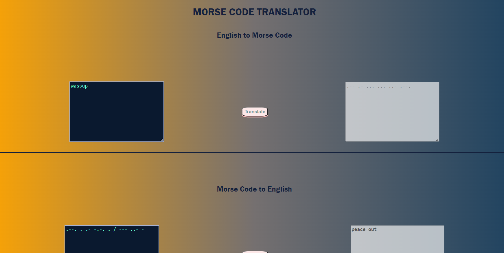

# Morse Code Translator

This project was a challenge for the Nology developer course. It translates English to Morse Code and vice-versa, this was achieved using an object map method and key-value pairs.

---

-   [Morse Code Translator](#morse-code-translator)
    -   [Built with](#built-with)
    -   [Features](#features)
    -   [How to Use](#how-to-use)

## Built with

-   Javascript
-   CSS
-   HTML

## Features

This should work for most ASCII characters as well as numbers, characters and words.

## How to Use

Type in the dark blue box provided with the corresponding language and click on the 'translate' button to output a translation.
